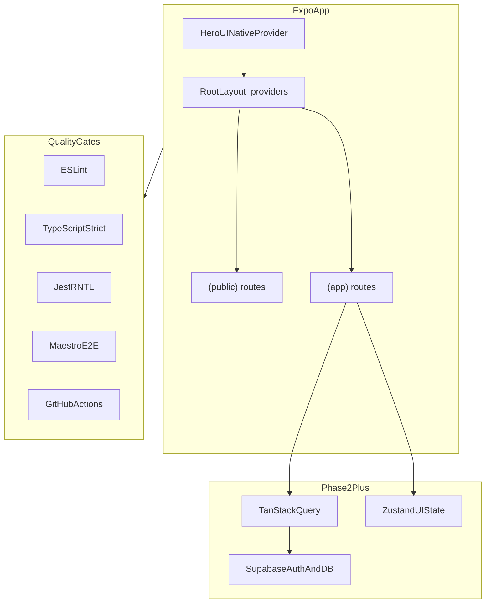
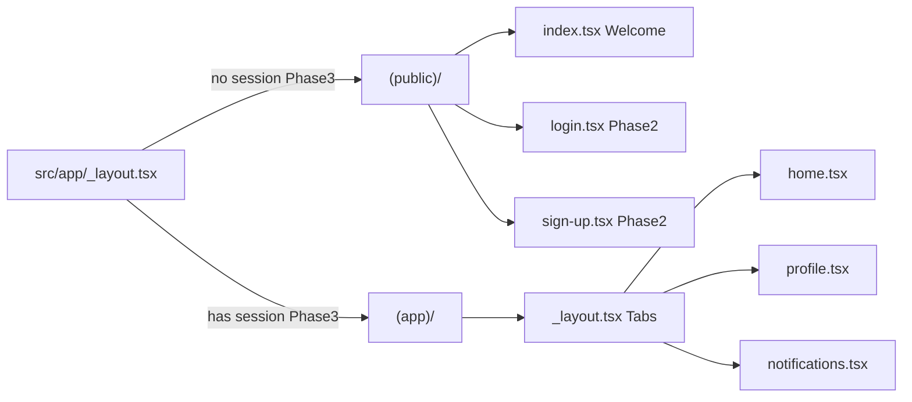

# Architecture

Filipi Boats is a mobile training app prototype. This document describes the **locked stack**, folder layout, routing model, and reliability principles. Implement features in small phases; see [ROADMAP.md](./ROADMAP.md).

## Stack

| Layer | Choice | Notes |
|-------|--------|-------|
| Mobile shell | Expo SDK 54, React Native 0.81, Expo Router | Matches App Store / Play Store Expo Go (SDK 54) |
| Language | TypeScript (`strict: true`) | Path alias `@/*` → `src/*` |
| UI | HeroUI Native + Uniwind | Tailwind-style utility classes via `className` |
| Backend | Supabase (Phase 2+) | Postgres, Auth, RLS, Realtime — free tier |
| Local / UI state | Zustand (Phase 4+) | Notifications badge, UI-only flags |
| Server state | TanStack Query (Phase 5+) | Caching, retries, loading/error for Supabase |
| Unit / component tests | Jest (`jest-expo`) + RNTL | Fast feedback in CI |
| E2E | Maestro | Critical flows; CI E2E in Phase 7 |
| CI | GitHub Actions | lint → typecheck → test |

Scaffolded with `create-heroui-native-app` (Expo + HeroUI Native + Uniwind prewired). App code lives under `src/` (CLI convention), not a root-level `app/` folder.

## High-level diagram

## Routing model

Expo Router **route groups** separate public and authenticated areas:

| Path | Role |
|------|------|
| `src/app/_layout.tsx` | Providers (`GestureHandlerRootView`, `HeroUINativeProvider`). Phase 3 adds session gate. |
| `src/app/(public)/` | Welcome, login, sign-up — no auth required |
| `src/app/(app)/` | Tab shell: Home, Profile, Notifications — behind auth from Phase 3 |

**Phase 3 note:** `AuthProvider` in `src/providers/auth-provider.tsx` listens to Supabase session state. Root layout shows a loading screen until the session is known, then redirects between `(public)` and `(app)`.

## Layer responsibilities

| Directory | Responsibility |
|-----------|----------------|
| `src/app/` | Screens and layouts only — navigation and composition |
| `src/components/` | Reusable UI pieces extracted from screens |
| `src/lib/` | External clients (Supabase), helpers, validators |
| `src/stores/` | Zustand stores for local/UI state |
| `__tests__/` | Jest + RNTL tests (colocated `*.test.tsx` also allowed) |
| `.maestro/` | Maestro YAML E2E flows |
| `docs/` | Architecture, roadmap, testing |

### Future integration points

- **Supabase client** → `src/lib/supabase.ts` (Phase 2)
- **Auth session** → listen in `src/app/_layout.tsx`, redirect `(public)` ↔ `(app)` (Phase 3)
- **Notification mock store** → `src/stores/notifications.ts` (Phase 4)
- **Profile queries** → TanStack Query hooks that call `src/lib/` (Phase 5)
- **RLS** → Supabase policies so users only read/write their own rows (Phase 5)

## Reliability principles

1. **Tests ship with features** — every phase adds at least one automated check.
2. **TypeScript strict** — prefer compile-time failures over runtime surprises.
3. **Test by behavior** — query visible text, roles, and `testID`s; avoid implementation details.
4. **Every interactive element** gets a `testID` and an accessibility label (from Phase 1).
5. **No silent `catch` blocks** — show UI error or log in development.
6. **Supabase data access** — only through `src/lib/` + TanStack Query hooks; enforce RLS.
7. **Secrets stay out of git** — use `.env` locally; commit only `.env.example`.

## Environment variables

| Variable | When | Description |
|----------|------|-------------|
| `EXPO_PUBLIC_SUPABASE_URL` | Phase 2+ | Supabase project URL |
| `EXPO_PUBLIC_SUPABASE_ANON_KEY` | Phase 2+ | Supabase anon (public) key |

See [`.env.example`](../.env.example).

## Related docs

- [ROADMAP.md](./ROADMAP.md) — phased delivery and DoD checklists
- [TESTING.md](./TESTING.md) — test pyramid, Maestro, CI
